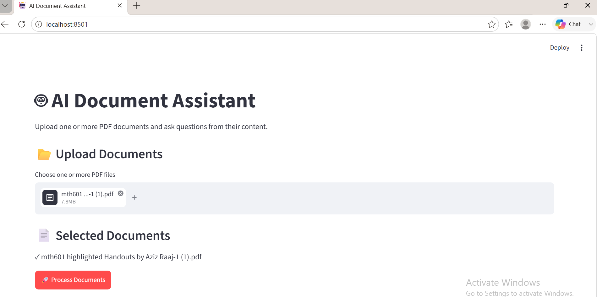
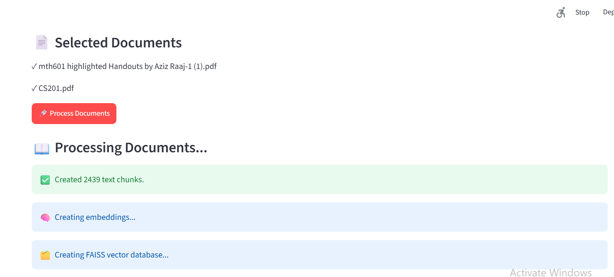
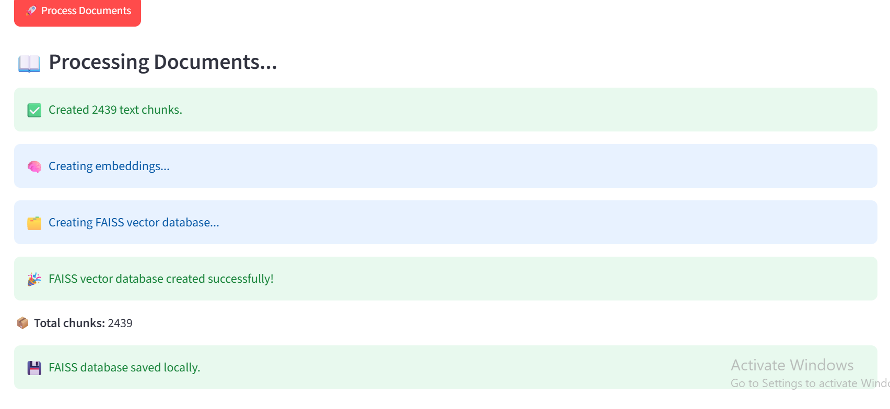
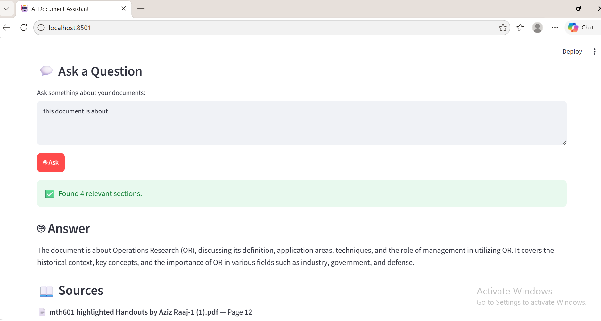

# AI Document Assistant

An AI-powered document question-answering application that allows users to upload PDF documents and ask questions about their content.

The application uses **Retrieval-Augmented Generation (RAG)** to retrieve relevant information from uploaded documents and generate answers using a locally running **Qwen 3 1.7B** language model through **Ollama**.

The project is designed as a practical portfolio and freelancing-ready foundation for building AI-powered document processing and automation solutions.

## Key Features

- Upload PDF documents
- Extract text from PDF pages
- Split extracted text into manageable chunks
- Generate semantic embeddings using Sentence Transformers
- Store document embeddings in a FAISS vector database
- Perform semantic similarity search
- Retrieve relevant document context for user questions
- Generate answers using Qwen 3 1.7B through Ollama
- Display document source and page information
- Run AI processing locally
- Reduce dependency on external AI APIs
- Basic protection against prompt injection from document content
- Indicate when relevant information cannot be found in the uploaded documents

## Screenshots

### Application Interface



### PDF Upload and Processing



### Question and Answer



### Source and Page Information



## How It Works

The application follows a Retrieval-Augmented Generation (RAG) pipeline:

```text
              PDF Document
                   │
                   ▼
             Text Extraction
                   │
                   ▼
              Text Chunking
                   │
                   ▼
          Semantic Embeddings
                   │
                   ▼
          FAISS Vector Database
                   │
                   │
User Question ────► Similarity Search
                   │
                   ▼
        Relevant Document Context
                   │
                   ▼
          Qwen 3 1.7B + Ollama
                   │
                   ▼
          Answer + Source/Page

          Technology Stack

          | Technology               | Purpose                  |
| ------------------------ | ------------------------ |
| Python                   | Application development  |
| Streamlit                | Web interface            |
| PyPDF                    | PDF text extraction      |
| LangChain Text Splitters | Document chunking        |
| Sentence Transformers    | Semantic embeddings      |
| FAISS                    | Vector similarity search |
| Ollama                   | Local LLM runtime        |
| Qwen 3 1.7B              | Local language model     |

Project Structure

AI-Document-Assistant/
│
├── documents/
│   ├── csv_processor.py
│   ├── document_router.py
│   ├── excel_processor.py
│   ├── pdf_processor.py
│   ├── text_processor.py
│   └── word_processor.py
│
├── llm/
│   └── answer_generator.py
│
├── Screenshots/
│   ├── 01-app-startup.png
│   ├── 02-processing.png
│   ├── 03-process-completed.png
│   └── 04-answer.png
│
├── app.py
├── requirements.txt
├── README.md
└── .gitignore

The documents module is structured to support future document-processing extensions beyond PDF files.

Requirements

Before running the application, make sure the following are installed:

Python 3.x
Ollama
Qwen 3 1.7B
Required Python packages listed in requirements.txt
Installation
1. Clone the Repository
git clone https://github.com/arssslanch-a11y/AI-Document-Assistant.git
cd AI-Document-Assistant
2. Create a Virtual Environment
python -m venv venv
3. Activate the Virtual Environment
Windows PowerShell
.\venv\Scripts\Activate.ps1
4. Install Python Dependencies
pip install -r requirements.txt
5. Install and Run Qwen Through Ollama
ollama run qwen3:1.7b

Make sure Ollama is installed and running before starting the application.

6. Start the Application
streamlit run app.py

Streamlit will display a local URL in the terminal. Open that URL in your browser.

How to Use
Start Ollama and make sure the Qwen 3 1.7B model is available.
Start the Streamlit application.
Upload a PDF document.
Allow the application to process and index the document.
Enter a question related to the uploaded document.
The application retrieves the most relevant document content.
Qwen 3 1.7B generates an answer using the retrieved context.
The application displays the answer together with source and page information.
Security Considerations

Uploaded document content is treated as untrusted data.

The application is designed to reduce the risk of document-based prompt injection by instructing the language model to:

Use retrieved document content as reference material rather than executable instructions
Avoid following instructions contained inside uploaded documents
Avoid revealing system prompts or internal instructions
Avoid generating unsupported information
Clearly indicate when relevant information is not available in the provided documents

Additional security hardening can be added as the application moves toward production deployment.

Current Limitations
The current primary workflow focuses on PDF documents.
Large documents may require significant processing time.
Embedding generation can be computationally intensive on low-spec hardware.
Local LLM response speed depends on available CPU, RAM, and GPU resources.
The current version is a working prototype rather than a production SaaS application.
Future Improvements

Planned improvements include:

Multi-document management
Faster document processing
Improved document indexing
Background document processing
Document classification
Structured information extraction
Automatic document routing
Manual review workflow
Additional document formats
Server-side processing
Production deployment
User authentication and access control
Improved monitoring and logging
Real-World Applications

The underlying architecture can be extended to support practical business workflows such as:

Company policy document assistants
Internal knowledge bases
Customer document search
Invoice and business document processing
Legal document research
HR document assistants
Automated document classification
Document extraction and routing workflows
Project Status

Working Prototype / Portfolio Project

This project demonstrates a practical Retrieval-Augmented Generation (RAG) workflow using local AI technologies.

It is being developed as a foundation for more advanced AI document-processing and automation solutions suitable for real-world business use cases.

Author

Arslan

GitHub

github.com/arssslanch-a11y